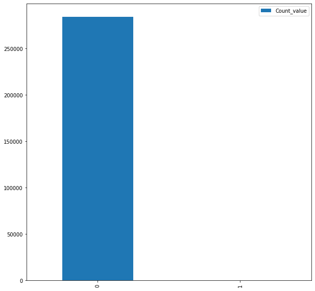
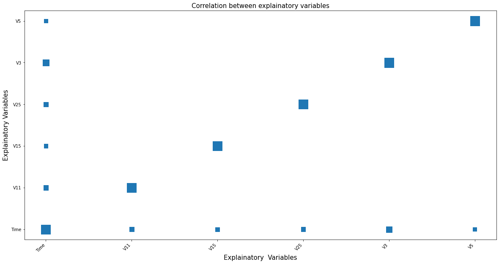
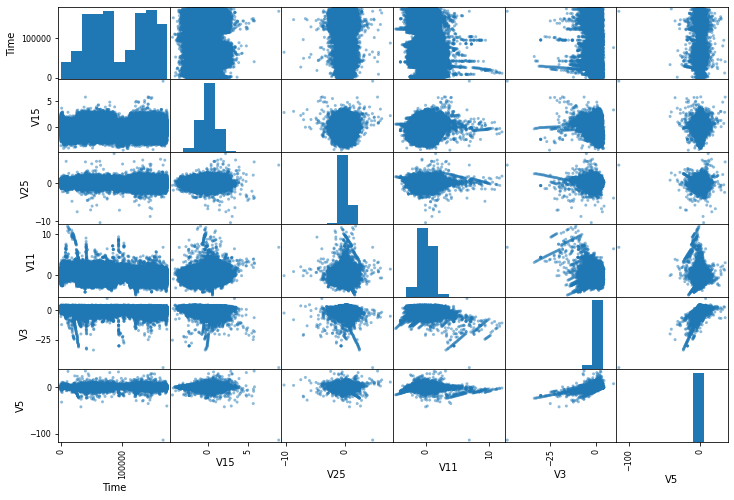
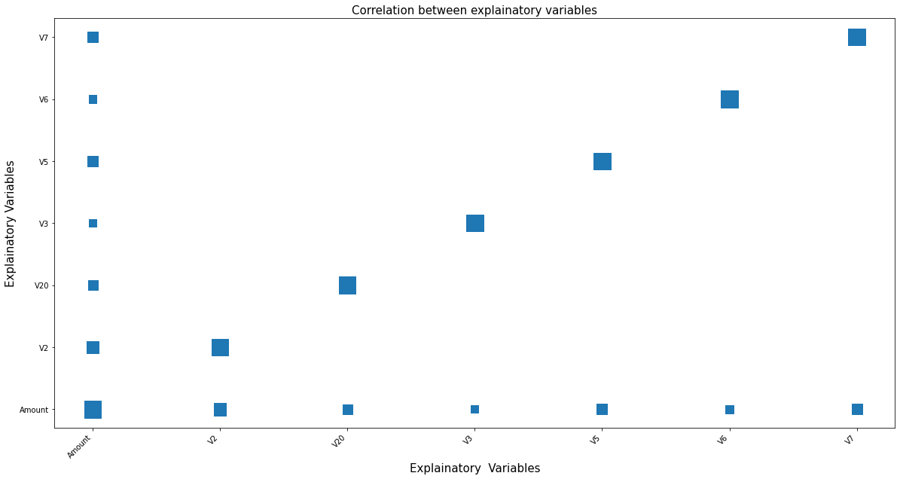
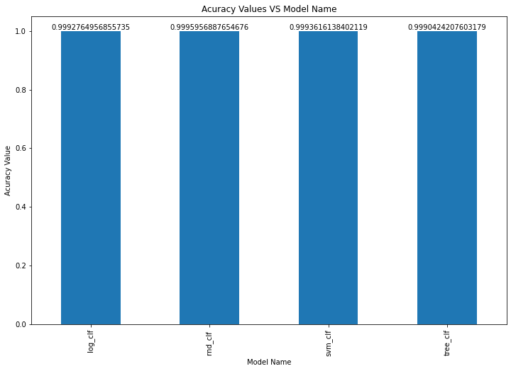
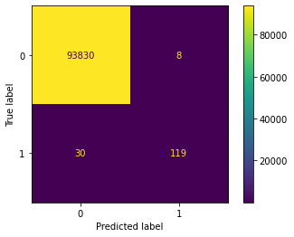
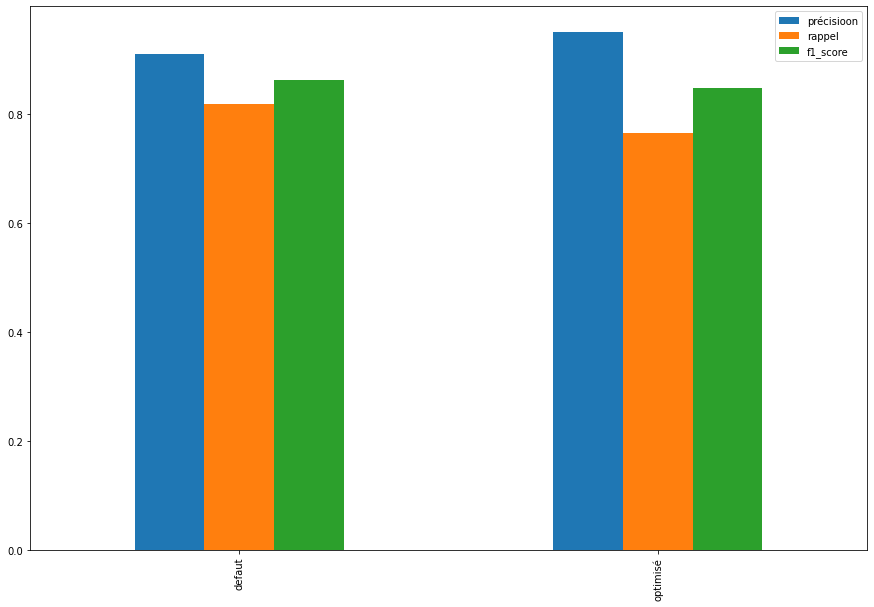

# Patrice  Manfo: Data Scientist and industrial reliability engineer,
# Founder of INGEDAMINING.
 
 
 


# Contents

1.[***Introduction***](#int)

2.[***Context***](#cont)

3.[***Input data***](#imp)
  * 3.1[**Pre-examination of the data structure**](#pres)
  * 3.2[**Data visualization**](#dvi)
  * 3.3[**Study of correlations between variables**](#stc)
       * 3.3.1 [*Anonymized variables*](#ano)
       * 3.3.2 [*Known variables*](#kno)
       
4.[***Model selection***](#modsel)
  * 4.1[**Generation of the training and the test dataset**](#trts)
  * 4.2[**Optimization of the random forest model (RandomForestClassifier)**](#opt)
  * 4.3[**Analysis of the result after optimization**](#ana)
       * 4.3.1 [*Compative study of the model based on the different performance indicators*](#com)
       * 4.3.2 [*Global performance (ROC curve)*](#per)

5.[***Discussion***](#diss)

6.[***Conclusion***](#con)

7.[***Future works***](#fut)

# 1. Introduction <a name ="int"></a>

***
It is no longer a secret that the development during the last decades of the Internet has significantly impacted any sector of activity. From industry to service, no company has remained on the sidelines of this revolution. All the more true as the activity of the banking sector has seen its processes completely dematerialized , thus allowing to accelerate transactions processing time , reducing the volume of storage of documents in paper format etc … This revolution has considerably contributed to the development of banking activity, but also generating lots of security problems.We are interested in the context of this presebtaion to financial transactions security Problem.In other words can   [machine Learning](https://fr.wikipedia.org/wiki/Apprentissage_automatique) help predicting  potential fraudulent transactions such as to help taking right decision to reduce and even avoid fraud ?.
***

## 2.Context <a name="cont"></a>
***
This study aims to evaluate the ability of machine learning to help banks detect fraudulent transactions such as  to prevent customers from being debited for transactions for which they are not the authors.In a hyper-competitive world like the one we live in, where Customers are more and more demanding,this would undoubtedly be one of the best way  to attract ,reassure and retain bank stakeholders and clients. 
***

##  3. Input data <a name="imp"></a>

***
The data for this study comes from the kaggle website, which covers all transactions carried out in 2013 by bank card holders. For confidentiality reasons, some data has been pre-processed and anonymized except the variables ***Time*** and ***Amount***.
***


```python
!pip3 install pandas
```


```python
# import necessary library
import pandas as pd
import os 
```


```python
DATA_PATH = os.path.join(os.getcwd(), 'creditcard.csv')
```


```python
data  = pd.read_csv(DATA_PATH )
```

###  3.1 Pre-examination of the data structure <a name="pres"></a>


```python
data.head()
```


<div>
<style scoped>
    .dataframe tbody tr th:only-of-type {
        vertical-align: middle;
    }

    .dataframe tbody tr th {
        vertical-align: top;
    }

    .dataframe thead th {
        text-align: right;
    }
</style>
<table border="1" class="dataframe">
  <thead>
    <tr style="text-align: right;">
      <th></th>
      <th>Time</th>
      <th>V1</th>
      <th>V2</th>
      <th>V3</th>
      <th>V4</th>
      <th>V5</th>
      <th>V6</th>
      <th>V7</th>
      <th>V8</th>
      <th>V9</th>
      <th>...</th>
      <th>V21</th>
      <th>V22</th>
      <th>V23</th>
      <th>V24</th>
      <th>V25</th>
      <th>V26</th>
      <th>V27</th>
      <th>V28</th>
      <th>Amount</th>
      <th>Class</th>
    </tr>
  </thead>
  <tbody>
    <tr>
      <th>0</th>
      <td>0.0</td>
      <td>-1.359807</td>
      <td>-0.072781</td>
      <td>2.536347</td>
      <td>1.378155</td>
      <td>-0.338321</td>
      <td>0.462388</td>
      <td>0.239599</td>
      <td>0.098698</td>
      <td>0.363787</td>
      <td>...</td>
      <td>-0.018307</td>
      <td>0.277838</td>
      <td>-0.110474</td>
      <td>0.066928</td>
      <td>0.128539</td>
      <td>-0.189115</td>
      <td>0.133558</td>
      <td>-0.021053</td>
      <td>149.62</td>
      <td>0</td>
    </tr>
    <tr>
      <th>1</th>
      <td>0.0</td>
      <td>1.191857</td>
      <td>0.266151</td>
      <td>0.166480</td>
      <td>0.448154</td>
      <td>0.060018</td>
      <td>-0.082361</td>
      <td>-0.078803</td>
      <td>0.085102</td>
      <td>-0.255425</td>
      <td>...</td>
      <td>-0.225775</td>
      <td>-0.638672</td>
      <td>0.101288</td>
      <td>-0.339846</td>
      <td>0.167170</td>
      <td>0.125895</td>
      <td>-0.008983</td>
      <td>0.014724</td>
      <td>2.69</td>
      <td>0</td>
    </tr>
    <tr>
      <th>2</th>
      <td>1.0</td>
      <td>-1.358354</td>
      <td>-1.340163</td>
      <td>1.773209</td>
      <td>0.379780</td>
      <td>-0.503198</td>
      <td>1.800499</td>
      <td>0.791461</td>
      <td>0.247676</td>
      <td>-1.514654</td>
      <td>...</td>
      <td>0.247998</td>
      <td>0.771679</td>
      <td>0.909412</td>
      <td>-0.689281</td>
      <td>-0.327642</td>
      <td>-0.139097</td>
      <td>-0.055353</td>
      <td>-0.059752</td>
      <td>378.66</td>
      <td>0</td>
    </tr>
    <tr>
      <th>3</th>
      <td>1.0</td>
      <td>-0.966272</td>
      <td>-0.185226</td>
      <td>1.792993</td>
      <td>-0.863291</td>
      <td>-0.010309</td>
      <td>1.247203</td>
      <td>0.237609</td>
      <td>0.377436</td>
      <td>-1.387024</td>
      <td>...</td>
      <td>-0.108300</td>
      <td>0.005274</td>
      <td>-0.190321</td>
      <td>-1.175575</td>
      <td>0.647376</td>
      <td>-0.221929</td>
      <td>0.062723</td>
      <td>0.061458</td>
      <td>123.50</td>
      <td>0</td>
    </tr>
    <tr>
      <th>4</th>
      <td>2.0</td>
      <td>-1.158233</td>
      <td>0.877737</td>
      <td>1.548718</td>
      <td>0.403034</td>
      <td>-0.407193</td>
      <td>0.095921</td>
      <td>0.592941</td>
      <td>-0.270533</td>
      <td>0.817739</td>
      <td>...</td>
      <td>-0.009431</td>
      <td>0.798278</td>
      <td>-0.137458</td>
      <td>0.141267</td>
      <td>-0.206010</td>
      <td>0.502292</td>
      <td>0.219422</td>
      <td>0.215153</td>
      <td>69.99</td>
      <td>0</td>
    </tr>
  </tbody>
</table>
<p>5 rows × 31 columns</p>
</div>


***
We have a total of ***31*** columns. The first ***30*** are the explanatory variables, the last Class is the variable to predict. Except the variables Time and Amount, all others have been anonymized for confidentiality reasons.
***


```python
data.info()
```

    <class 'pandas.core.frame.DataFrame'>
    RangeIndex: 284807 entries, 0 to 284806
    Data columns (total 31 columns):
     #   Column  Non-Null Count   Dtype  
    ---  ------  --------------   -----  
     0   Time    284807 non-null  float64
     1   V1      284807 non-null  float64
     2   V2      284807 non-null  float64
     3   V3      284807 non-null  float64
     4   V4      284807 non-null  float64
     5   V5      284807 non-null  float64
     6   V6      284807 non-null  float64
     7   V7      284807 non-null  float64
     8   V8      284807 non-null  float64
     9   V9      284807 non-null  float64
     10  V10     284807 non-null  float64
     11  V11     284807 non-null  float64
     12  V12     284807 non-null  float64
     13  V13     284807 non-null  float64
     14  V14     284807 non-null  float64
     15  V15     284807 non-null  float64
     16  V16     284807 non-null  float64
     17  V17     284807 non-null  float64
     18  V18     284807 non-null  float64
     19  V19     284807 non-null  float64
     20  V20     284807 non-null  float64
     21  V21     284807 non-null  float64
     22  V22     284807 non-null  float64
     23  V23     284807 non-null  float64
     24  V24     284807 non-null  float64
     25  V25     284807 non-null  float64
     26  V26     284807 non-null  float64
     27  V27     284807 non-null  float64
     28  V28     284807 non-null  float64
     29  Amount  284807 non-null  float64
     30  Class   284807 non-null  int64  
    dtypes: float64(30), int64(1)
    memory usage: 67.4 MB


***
There are ***284807*** rows and no missing values. Except the column Class , all others are floatants.
***


```python
#Count the size of each class(two classes: 0 and 1)
count_class = pd.DataFrame(data.Class.value_counts()).rename(columns={"Class":"Count_value"})
```


```python
count_class.head()
```


<div>
<style scoped>
    .dataframe tbody tr th:only-of-type {
        vertical-align: middle;
    }

    .dataframe tbody tr th {
        vertical-align: top;
    }

    .dataframe thead th {
        text-align: right;
    }
</style>
<table border="1" class="dataframe">
  <thead>
    <tr style="text-align: right;">
      <th></th>
      <th>Count_value</th>
    </tr>
  </thead>
  <tbody>
    <tr>
      <th>0</th>
      <td>284315</td>
    </tr>
    <tr>
      <th>1</th>
      <td>492</td>
    </tr>
  </tbody>
</table>
</div>


```python
!pip3 install matplotlib
```


```python
#plot of the classes counts
%matplotlib inline
import matplotlib.pyplot as plt
import warnings
warnings.filterwarnings('ignore')
count_class.plot.bar(figsize =(10,10))
```

    Matplotlib is building the font cache; this may take a moment.


    <AxesSubplot:>


    

    


***
We have a total of ***284315*** lines classified ***0*** against ***492*** lines classified ***1***. We can also see through the preceding graph that the class 1 is almost invisible being in minority with resptect to the class ***0***, so we have an unbalanced data set.
***
***Nb***: Aline classified ***0*** means there is no fraud observed for the coresponding transaction respectively the one classified ***1*** represents transactions for which fraud was observed.


```python
data.describe()
```


<div>
<style scoped>
    .dataframe tbody tr th:only-of-type {
        vertical-align: middle;
    }

    .dataframe tbody tr th {
        vertical-align: top;
    }

    .dataframe thead th {
        text-align: right;
    }
</style>
<table border="1" class="dataframe">
  <thead>
    <tr style="text-align: right;">
      <th></th>
      <th>Time</th>
      <th>V1</th>
      <th>V2</th>
      <th>V3</th>
      <th>V4</th>
      <th>V5</th>
      <th>V6</th>
      <th>V7</th>
      <th>V8</th>
      <th>V9</th>
      <th>...</th>
      <th>V21</th>
      <th>V22</th>
      <th>V23</th>
      <th>V24</th>
      <th>V25</th>
      <th>V26</th>
      <th>V27</th>
      <th>V28</th>
      <th>Amount</th>
      <th>Class</th>
    </tr>
  </thead>
  <tbody>
    <tr>
      <th>count</th>
      <td>284807.000000</td>
      <td>2.848070e+05</td>
      <td>2.848070e+05</td>
      <td>2.848070e+05</td>
      <td>2.848070e+05</td>
      <td>2.848070e+05</td>
      <td>2.848070e+05</td>
      <td>2.848070e+05</td>
      <td>2.848070e+05</td>
      <td>2.848070e+05</td>
      <td>...</td>
      <td>2.848070e+05</td>
      <td>2.848070e+05</td>
      <td>2.848070e+05</td>
      <td>2.848070e+05</td>
      <td>2.848070e+05</td>
      <td>2.848070e+05</td>
      <td>2.848070e+05</td>
      <td>2.848070e+05</td>
      <td>284807.000000</td>
      <td>284807.000000</td>
    </tr>
    <tr>
      <th>mean</th>
      <td>94813.859575</td>
      <td>1.168375e-15</td>
      <td>3.416908e-16</td>
      <td>-1.379537e-15</td>
      <td>2.074095e-15</td>
      <td>9.604066e-16</td>
      <td>1.487313e-15</td>
      <td>-5.556467e-16</td>
      <td>1.213481e-16</td>
      <td>-2.406331e-15</td>
      <td>...</td>
      <td>1.654067e-16</td>
      <td>-3.568593e-16</td>
      <td>2.578648e-16</td>
      <td>4.473266e-15</td>
      <td>5.340915e-16</td>
      <td>1.683437e-15</td>
      <td>-3.660091e-16</td>
      <td>-1.227390e-16</td>
      <td>88.349619</td>
      <td>0.001727</td>
    </tr>
    <tr>
      <th>std</th>
      <td>47488.145955</td>
      <td>1.958696e+00</td>
      <td>1.651309e+00</td>
      <td>1.516255e+00</td>
      <td>1.415869e+00</td>
      <td>1.380247e+00</td>
      <td>1.332271e+00</td>
      <td>1.237094e+00</td>
      <td>1.194353e+00</td>
      <td>1.098632e+00</td>
      <td>...</td>
      <td>7.345240e-01</td>
      <td>7.257016e-01</td>
      <td>6.244603e-01</td>
      <td>6.056471e-01</td>
      <td>5.212781e-01</td>
      <td>4.822270e-01</td>
      <td>4.036325e-01</td>
      <td>3.300833e-01</td>
      <td>250.120109</td>
      <td>0.041527</td>
    </tr>
    <tr>
      <th>min</th>
      <td>0.000000</td>
      <td>-5.640751e+01</td>
      <td>-7.271573e+01</td>
      <td>-4.832559e+01</td>
      <td>-5.683171e+00</td>
      <td>-1.137433e+02</td>
      <td>-2.616051e+01</td>
      <td>-4.355724e+01</td>
      <td>-7.321672e+01</td>
      <td>-1.343407e+01</td>
      <td>...</td>
      <td>-3.483038e+01</td>
      <td>-1.093314e+01</td>
      <td>-4.480774e+01</td>
      <td>-2.836627e+00</td>
      <td>-1.029540e+01</td>
      <td>-2.604551e+00</td>
      <td>-2.256568e+01</td>
      <td>-1.543008e+01</td>
      <td>0.000000</td>
      <td>0.000000</td>
    </tr>
    <tr>
      <th>25%</th>
      <td>54201.500000</td>
      <td>-9.203734e-01</td>
      <td>-5.985499e-01</td>
      <td>-8.903648e-01</td>
      <td>-8.486401e-01</td>
      <td>-6.915971e-01</td>
      <td>-7.682956e-01</td>
      <td>-5.540759e-01</td>
      <td>-2.086297e-01</td>
      <td>-6.430976e-01</td>
      <td>...</td>
      <td>-2.283949e-01</td>
      <td>-5.423504e-01</td>
      <td>-1.618463e-01</td>
      <td>-3.545861e-01</td>
      <td>-3.171451e-01</td>
      <td>-3.269839e-01</td>
      <td>-7.083953e-02</td>
      <td>-5.295979e-02</td>
      <td>5.600000</td>
      <td>0.000000</td>
    </tr>
    <tr>
      <th>50%</th>
      <td>84692.000000</td>
      <td>1.810880e-02</td>
      <td>6.548556e-02</td>
      <td>1.798463e-01</td>
      <td>-1.984653e-02</td>
      <td>-5.433583e-02</td>
      <td>-2.741871e-01</td>
      <td>4.010308e-02</td>
      <td>2.235804e-02</td>
      <td>-5.142873e-02</td>
      <td>...</td>
      <td>-2.945017e-02</td>
      <td>6.781943e-03</td>
      <td>-1.119293e-02</td>
      <td>4.097606e-02</td>
      <td>1.659350e-02</td>
      <td>-5.213911e-02</td>
      <td>1.342146e-03</td>
      <td>1.124383e-02</td>
      <td>22.000000</td>
      <td>0.000000</td>
    </tr>
    <tr>
      <th>75%</th>
      <td>139320.500000</td>
      <td>1.315642e+00</td>
      <td>8.037239e-01</td>
      <td>1.027196e+00</td>
      <td>7.433413e-01</td>
      <td>6.119264e-01</td>
      <td>3.985649e-01</td>
      <td>5.704361e-01</td>
      <td>3.273459e-01</td>
      <td>5.971390e-01</td>
      <td>...</td>
      <td>1.863772e-01</td>
      <td>5.285536e-01</td>
      <td>1.476421e-01</td>
      <td>4.395266e-01</td>
      <td>3.507156e-01</td>
      <td>2.409522e-01</td>
      <td>9.104512e-02</td>
      <td>7.827995e-02</td>
      <td>77.165000</td>
      <td>0.000000</td>
    </tr>
    <tr>
      <th>max</th>
      <td>172792.000000</td>
      <td>2.454930e+00</td>
      <td>2.205773e+01</td>
      <td>9.382558e+00</td>
      <td>1.687534e+01</td>
      <td>3.480167e+01</td>
      <td>7.330163e+01</td>
      <td>1.205895e+02</td>
      <td>2.000721e+01</td>
      <td>1.559499e+01</td>
      <td>...</td>
      <td>2.720284e+01</td>
      <td>1.050309e+01</td>
      <td>2.252841e+01</td>
      <td>4.584549e+00</td>
      <td>7.519589e+00</td>
      <td>3.517346e+00</td>
      <td>3.161220e+01</td>
      <td>3.384781e+01</td>
      <td>25691.160000</td>
      <td>1.000000</td>
    </tr>
  </tbody>
</table>
<p>8 rows × 31 columns</p>
</div>


### 3.2 Data visualization <a name="dvi">
                            


```python
%matplotlib inline
import matplotlib.pyplot as plt
warnings.filterwarnings('ignore')
data.iloc[:,0:30].hist(bins=50,figsize=(20,15))
plt.show()
```


    

    


***
The explanatory variables are concentrated around zero; most of them seem to be normaly distributed .The ***Time*** and ***Amount*** variables have a much larger order of magnitude. To avoid the scale effect, it would therefore be opportune to center them around zero and reduce them.
***

### 3.3 Study of correlations between variables <a name="stc"></a>

#### 3.3.1 Anonymized variables <a name= "ano"></a>


```python
#variables anonymised names
var_ano = [name for  name in data.columns if (not name in ('Time','Amount','Class')) ]
```


```python
var_ano
```


    ['V1',
     'V2',
     'V3',
     'V4',
     'V5',
     'V6',
     'V7',
     'V8',
     'V9',
     'V10',
     'V11',
     'V12',
     'V13',
     'V14',
     'V15',
     'V16',
     'V17',
     'V18',
     'V19',
     'V20',
     'V21',
     'V22',
     'V23',
     'V24',
     'V25',
     'V26',
     'V27',
     'V28']


```python
corel_ano = data[var_ano].corr()
```


```python
import matplotlib.pyplot as plt
```


```python
# Step 1 - Make a scatter plot with square markers, set column names as labels

def heatmap(x, y, size):
    fig, ax = plt.subplots(figsize=(20, 10))
    
    # Mapping from column names to integer coordinates
    x_labels = [v for v in sorted(x.unique())]
    y_labels = [v for v in sorted(y.unique())]
    x_to_num = {p[1]:p[0] for p in enumerate(x_labels)} 
    y_to_num = {p[1]:p[0] for p in enumerate(y_labels)} 
    
    size_scale = 500
    ax.scatter(
        x=x.map(x_to_num), # Use mapping for x
        y=y.map(y_to_num), # Use mapping for y
        s=size * size_scale, # Vector of square sizes, proportional to size parameter
        marker='s' # Use square as scatterplot marker
    )
    
    # Show column labels on the axes
    ax.set_xticks([x_to_num[v] for v in x_labels])
    ax.set_xticklabels(x_labels, rotation=45, horizontalalignment='right')
    ax.set_yticks([y_to_num[v] for v in y_labels])
    ax.set_yticklabels(y_labels)
    plt.xlabel('Explainatory  Variables', fontsize=15)
    plt.ylabel('Explainatory Variables', fontsize=15)
    plt.title("Correlation between explainatory variables", fontsize=15, fontdict=None, loc='center', pad=None)
    
    

corr = data[var_ano].corr()
corr = pd.melt(corr.reset_index(), id_vars='index') # Unpivot the dataframe, so we can get pair of arrays for x and y
corr.columns = ['x', 'y', 'value']
heatmap(
    x=corr['x'],
    y=corr['y'],
    size=corr['value'].abs()
)

```


    

    


```python
#remove diagonale
def remove_diag(x):
    x_no_diag = np.ndarray.flatten(x)
    x_no_diag = np.delete(x_no_diag, range(0, len(x_no_diag), len(x) + 1), 0)
    x_no_diag = x_no_diag.reshape(len(x), len(x) - 1)
    return x_no_diag
```


```python
!pip3 install  numpy
```

    Requirement already satisfied: numpy in /home/patrice/.local/lib/python3.8/site-packages (1.19.5)


```python
import numpy as np
```


```python
coremat = corel_ano.values
```


```python
cor_without_dia = remove_diag(coremat)
```


```python
cor_without_dia.max()
```


    3.784757449242497e-15


***
The previous figure on the correlations shows that there is no noticeable correlation between the anonymized explanatory variables. The maximum value of the correlation coefficient measured is ***3.784757449242497e-15***, they cannot therefore be considered as correlated with such low coefficient values.
***

#### 3.3.2 Known variables <a name="kno"></a>


```python
coor_matrix = data.iloc[:,0:30].corr()
```


```python
coor_matrix["Time"].sort_values(ascending=False)
```


    Time      1.000000
    V5        0.173072
    V22       0.144059
    V12       0.124348
    V1        0.117396
    V18       0.090438
    V7        0.084714
    V23       0.051142
    V21       0.044736
    V10       0.030617
    V19       0.028975
    V16       0.011903
    V27      -0.005135
    V9       -0.008660
    V28      -0.009413
    V2       -0.010593
    Amount   -0.010596
    V24      -0.016182
    V8       -0.036949
    V26      -0.041407
    V20      -0.050866
    V6       -0.063016
    V13      -0.065902
    V17      -0.073297
    V14      -0.098757
    V4       -0.105260
    V15      -0.183453
    V25      -0.233083
    V11      -0.247689
    V3       -0.419618
    Name: Time, dtype: float64


***
Contrary to the previous case, we now have some variables which seem correlated. Let go a litle bit deeper into some of these variables.
***


```python
Time_list = ["Time", "V15", "V25", "V11", "V3", "V5"]
```


```python
cor_time_list = data[Time_list]
```


```python
corr1 = data[Time_list].corr()
corr1 = pd.melt(corr1.reset_index(), id_vars='index') # Unpivot the dataframe, so we can get pair of arrays for x and y
corr1.columns = ['x', 'y', 'value']
heatmap(
    x=corr1['x'],
    y=corr1['y'],
    size=corr1['value'].abs()
)
```


    

    


```python
from pandas.plotting import scatter_matrix
```


```python
%matplotlib inline
import matplotlib.pyplot as plt
scatter_matrix(cor_time_list, figsize=(12,8))
plt.show()
```


    

    


```python
amount_list = ["Amount", "V7", "V20", "V6", "V2", "V5","V3"]
```


```python
coor_matrix["Amount"].sort_values(ascending=False)
```


    Amount    1.000000
    V7        0.397311
    V20       0.339403
    V6        0.215981
    V21       0.105999
    V4        0.098732
    V18       0.035650
    V14       0.033751
    V27       0.028825
    V28       0.010258
    V17       0.007309
    V13       0.005293
    V24       0.005146
    V11       0.000104
    V15      -0.002986
    V26      -0.003208
    V16      -0.003910
    V12      -0.009542
    Time     -0.010596
    V9       -0.044246
    V25      -0.047837
    V19      -0.056151
    V22      -0.064801
    V10      -0.101502
    V8       -0.103079
    V23      -0.112633
    V3       -0.210880
    V1       -0.227709
    V5       -0.386356
    V2       -0.531409
    Name: Amount, dtype: float64


```python
amount_list_cor = data[amount_list]
```


```python
%matplotlib inline
corr2 = data[amount_list].corr()
corr2 = pd.melt(corr2.reset_index(), id_vars='index') # Unpivot the dataframe, so we can get pair of arrays for x and y
corr2.columns = ['x', 'y', 'value']
heatmap(
    x=corr2['x'],
    y=corr2['y'],
    size=corr2['value'].abs()
)
plt.show()
```


    

    


```python
amount_list_cor = data[amount_list]
```


```python
%matplotlib inline
import matplotlib.pyplot as plt
scatter_matrix(amount_list_cor, figsize=(12,8))
plt.show()
```


    

    


***
The preceding figures show certain correlations between explanatory anonymized variables and the variables Time and Amount . We can therefore do further post-processing in order to decorrelate them. One of the most used and popular methods remains the commonly call principal component decomposition [PCA](https://fr.wikipedia.org/wiki/PCA) .For this presentation, we will stop at this level and, depending on the results that we will obtain subsequently, we may have to come back here to futher process the data set.
***

## 4. Model selection <a name="modsel"></a>

***
We now move on to model selection. We are not going to test all models but just a few of the relatively well-known, sourced , documented and populars. We will then optimize the model which will offer better performances. To do this, it will first be necessary to generate the training dataset that will allow learning the model coeficients , and the test dataset to measure the performances of the model, the objective being to generalize the model to cases of transactions not yet observed.
***


```python
data.columns[30]
```


    'Class'


```python
!pip3 install -U scikit-learn
```


```python
from sklearn.preprocessing import StandardScaler
from sklearn.model_selection import train_test_split
```


```python
X_train, X_test, y_train, y_test = train_test_split(
    data.iloc[:,0:30], data.iloc[:,30], test_size=0.33, random_state=42)
```


```python
X_train.astype(np.float64)
```


<div>
<style scoped>
    .dataframe tbody tr th:only-of-type {
        vertical-align: middle;
    }

    .dataframe tbody tr th {
        vertical-align: top;
    }

    .dataframe thead th {
        text-align: right;
    }
</style>
<table border="1" class="dataframe">
  <thead>
    <tr style="text-align: right;">
      <th></th>
      <th>Time</th>
      <th>V1</th>
      <th>V2</th>
      <th>V3</th>
      <th>V4</th>
      <th>V5</th>
      <th>V6</th>
      <th>V7</th>
      <th>V8</th>
      <th>V9</th>
      <th>...</th>
      <th>V20</th>
      <th>V21</th>
      <th>V22</th>
      <th>V23</th>
      <th>V24</th>
      <th>V25</th>
      <th>V26</th>
      <th>V27</th>
      <th>V28</th>
      <th>Amount</th>
    </tr>
  </thead>
  <tbody>
    <tr>
      <th>134955</th>
      <td>81047.0</td>
      <td>1.146174</td>
      <td>-0.083967</td>
      <td>0.602963</td>
      <td>0.725410</td>
      <td>-0.396283</td>
      <td>0.186275</td>
      <td>-0.318544</td>
      <td>0.185287</td>
      <td>0.362387</td>
      <td>...</td>
      <td>-0.155253</td>
      <td>-0.012052</td>
      <td>0.219314</td>
      <td>-0.068172</td>
      <td>0.077802</td>
      <td>0.482796</td>
      <td>0.451360</td>
      <td>-0.002776</td>
      <td>-0.003524</td>
      <td>2.97</td>
    </tr>
    <tr>
      <th>84470</th>
      <td>60323.0</td>
      <td>-0.918050</td>
      <td>0.578744</td>
      <td>1.168159</td>
      <td>-0.862173</td>
      <td>0.969264</td>
      <td>0.483973</td>
      <td>0.953430</td>
      <td>0.188512</td>
      <td>-0.866718</td>
      <td>...</td>
      <td>0.104206</td>
      <td>0.102956</td>
      <td>0.073220</td>
      <td>-0.324398</td>
      <td>-1.129387</td>
      <td>0.622502</td>
      <td>0.395548</td>
      <td>-0.042526</td>
      <td>0.032731</td>
      <td>72.73</td>
    </tr>
    <tr>
      <th>176085</th>
      <td>122620.0</td>
      <td>-2.013096</td>
      <td>-3.261460</td>
      <td>-1.443935</td>
      <td>0.149307</td>
      <td>2.734412</td>
      <td>-1.572646</td>
      <td>0.380914</td>
      <td>-0.058952</td>
      <td>0.668700</td>
      <td>...</td>
      <td>1.377841</td>
      <td>0.398680</td>
      <td>0.005726</td>
      <td>1.652294</td>
      <td>0.136111</td>
      <td>-1.705085</td>
      <td>-0.522617</td>
      <td>-0.031407</td>
      <td>0.243772</td>
      <td>387.80</td>
    </tr>
    <tr>
      <th>79348</th>
      <td>57979.0</td>
      <td>-0.767334</td>
      <td>0.383415</td>
      <td>0.210914</td>
      <td>0.035407</td>
      <td>0.059217</td>
      <td>1.220341</td>
      <td>-0.053366</td>
      <td>0.718190</td>
      <td>-1.945750</td>
      <td>...</td>
      <td>-0.064315</td>
      <td>-0.145465</td>
      <td>-0.121835</td>
      <td>-0.023886</td>
      <td>-1.764699</td>
      <td>-0.060345</td>
      <td>-0.080600</td>
      <td>0.292808</td>
      <td>0.112469</td>
      <td>105.54</td>
    </tr>
    <tr>
      <th>63554</th>
      <td>50771.0</td>
      <td>-0.817828</td>
      <td>1.621705</td>
      <td>0.911472</td>
      <td>1.305673</td>
      <td>-0.402086</td>
      <td>1.031816</td>
      <td>-1.972642</td>
      <td>-5.092458</td>
      <td>-1.570995</td>
      <td>...</td>
      <td>1.300047</td>
      <td>-2.932584</td>
      <td>-0.519522</td>
      <td>0.194226</td>
      <td>0.138621</td>
      <td>0.768231</td>
      <td>-0.580148</td>
      <td>0.027377</td>
      <td>0.213998</td>
      <td>28.45</td>
    </tr>
    <tr>
      <th>...</th>
      <td>...</td>
      <td>...</td>
      <td>...</td>
      <td>...</td>
      <td>...</td>
      <td>...</td>
      <td>...</td>
      <td>...</td>
      <td>...</td>
      <td>...</td>
      <td>...</td>
      <td>...</td>
      <td>...</td>
      <td>...</td>
      <td>...</td>
      <td>...</td>
      <td>...</td>
      <td>...</td>
      <td>...</td>
      <td>...</td>
      <td>...</td>
    </tr>
    <tr>
      <th>119879</th>
      <td>75618.0</td>
      <td>1.173488</td>
      <td>0.100792</td>
      <td>0.490512</td>
      <td>0.461596</td>
      <td>-0.296377</td>
      <td>-0.213165</td>
      <td>-0.165254</td>
      <td>0.119221</td>
      <td>-0.114199</td>
      <td>...</td>
      <td>-0.157534</td>
      <td>-0.186027</td>
      <td>-0.574283</td>
      <td>0.161405</td>
      <td>-0.006140</td>
      <td>0.091444</td>
      <td>0.109235</td>
      <td>-0.020922</td>
      <td>0.003967</td>
      <td>1.98</td>
    </tr>
    <tr>
      <th>259178</th>
      <td>159000.0</td>
      <td>-0.775981</td>
      <td>0.144023</td>
      <td>-1.142399</td>
      <td>-1.241113</td>
      <td>1.940358</td>
      <td>3.912076</td>
      <td>-0.466107</td>
      <td>1.360620</td>
      <td>0.400697</td>
      <td>...</td>
      <td>-0.295730</td>
      <td>0.037078</td>
      <td>-0.019575</td>
      <td>0.241830</td>
      <td>0.682820</td>
      <td>-1.635109</td>
      <td>-0.770941</td>
      <td>0.066006</td>
      <td>0.137056</td>
      <td>89.23</td>
    </tr>
    <tr>
      <th>131932</th>
      <td>79795.0</td>
      <td>-0.146609</td>
      <td>0.992946</td>
      <td>1.524591</td>
      <td>0.485774</td>
      <td>0.349308</td>
      <td>-0.815198</td>
      <td>1.076640</td>
      <td>-0.395316</td>
      <td>-0.491303</td>
      <td>...</td>
      <td>0.007155</td>
      <td>0.052649</td>
      <td>0.354089</td>
      <td>-0.291198</td>
      <td>0.402849</td>
      <td>0.237383</td>
      <td>-0.398467</td>
      <td>-0.121139</td>
      <td>-0.196195</td>
      <td>3.94</td>
    </tr>
    <tr>
      <th>146867</th>
      <td>87931.0</td>
      <td>-2.948638</td>
      <td>2.354849</td>
      <td>-2.521201</td>
      <td>-3.798905</td>
      <td>1.866302</td>
      <td>2.727695</td>
      <td>-0.471769</td>
      <td>2.217537</td>
      <td>0.580199</td>
      <td>...</td>
      <td>0.417396</td>
      <td>-0.332759</td>
      <td>-1.047514</td>
      <td>0.143326</td>
      <td>0.678869</td>
      <td>0.319710</td>
      <td>0.426309</td>
      <td>0.496912</td>
      <td>0.335822</td>
      <td>1.00</td>
    </tr>
    <tr>
      <th>121958</th>
      <td>76381.0</td>
      <td>1.233174</td>
      <td>-0.784851</td>
      <td>0.386784</td>
      <td>-0.698559</td>
      <td>-1.034018</td>
      <td>-0.637028</td>
      <td>-0.502369</td>
      <td>-0.188057</td>
      <td>-0.749637</td>
      <td>...</td>
      <td>0.337732</td>
      <td>0.027634</td>
      <td>-0.234522</td>
      <td>-0.059544</td>
      <td>-0.109073</td>
      <td>0.290326</td>
      <td>-0.393074</td>
      <td>0.001217</td>
      <td>0.038588</td>
      <td>113.00</td>
    </tr>
  </tbody>
</table>
<p>190820 rows × 30 columns</p>
</div>


```python
# center and reduce training data set
scaler = StandardScaler()
```


```python
x_train_scaled = scaler.fit_transform(X_train.astype(np.float64))
```


    ---------------------------------------------------------------------------

    NameError                                 Traceback (most recent call last)

    <ipython-input-10-2744bbbec9c4> in <module>
    ----> 1 x_train_scaled = scaler.fit_transform(X_train.astype(np.float64))
    

    NameError: name 'X_train' is not defined


```python
x_train_scaled 
```


    array([[-0.28810468,  0.58597879, -0.04896323, ..., -0.00559838,
            -0.01075461, -0.33151667],
           [-0.72457761, -0.46654537,  0.34837913, ..., -0.10320875,
             0.09981737, -0.06212196],
           [ 0.58747383, -1.0248967 , -1.95409701, ..., -0.07590531,
             0.74345036,  1.15459523],
           ...,
           [-0.31447334, -0.07319628,  0.59672272, ..., -0.29625279,
            -0.59836462, -0.32777079],
           [-0.14311918, -1.50191886,  1.41328077, ...,  1.22143674,
             1.02418324, -0.33912429],
           [-0.38637638,  0.6303394 , -0.4691931 , ...,  0.00420458,
             0.11767836,  0.09339015]])


```python
# import the models libraries
from sklearn.ensemble import RandomForestClassifier
from sklearn.linear_model import LogisticRegression
from sklearn.svm import SVC
from sklearn.tree import DecisionTreeClassifier
```

***
For this study we have ***4*** candidate models ([SVC](https://fr.wikipedia.org/wiki/Machine_%C3%A0_vecteurs_de_support), [random forest](https://fr.wikipedia.org/wiki/For%C3%AAt_d%27arbres_d%C3%A9cisionnels), [decision tree](https://fr.wikipedia.org/wiki/Arbre_de_d%C3%A9cision) and the [logistic regression](https://fr.wikipedia.org/wiki/R%C3%A9gression_logistique). It is therefore a question of identifying the best classifier amount this set of and optimize it thereafter.
***


```python
log_clf = LogisticRegression()
rnd_clf = RandomForestClassifier(random_state=42)
svm_clf = SVC()
tree_clf = DecisionTreeClassifier()
```


```python
from sklearn.metrics import accuracy_score
```


```python
X_test_scaled = scaler.fit_transform(X_test)
```


```python
acuracy_values = []
for clf in (log_clf, rnd_clf, svm_clf, tree_clf):
    clf.fit(x_train_scaled, y_train)
    y_pred = clf.predict(X_test_scaled)
    print(clf.__class__.__name__, accuracy_score(y_test, y_pred))
    acuracy_values.append(accuracy_score(y_test, y_pred))  
```

    LogisticRegression 0.9992764956855735
    RandomForestClassifier 0.9995956887654676
    SVC 0.9993616138402119
    DecisionTreeClassifier 0.9990424207603179


```python
import numpy as np
import pandas as pd

# so for consistency I create a series from the list.
acc_series = pd.Series(np.array(acuracy_values))
 
x_labels = ["log_clf", "rnd_clf ", "svm_clf" ,"tree_clf"]
# Plot the figure.
plt.figure(figsize=(12, 8))
ax = acc_series.plot(kind='bar')
ax.set_title('Acuracy Values VS Model Name')
ax.set_xlabel('Model Name')
ax.set_ylabel('Acuracy Value')
ax.set_xticklabels(x_labels)

rects = ax.patches

# Make some labels

for rect, label in zip(rects, acuracy_values):
    height = rect.get_height()
    ax.text(rect.get_x() + rect.get_width() / 2, height , label,
            ha='center', va='bottom')
    
plt.rcParams.update({'font.size': 10})
plt.show()
```


    

    


***
With a score of ***0.9995850489961378***, RandomForestClassifier might be the best candidate. With unbalanced data set , the most interesting metrics for measuring performance are ***precision*** , ***recall***, ***f1_score***, and *** the area under the ROC*** curve. These concepts will be discussed and better explained later in this presentation.
***

###  4.2 Optimization of the random forest model (RandomForestClassifier) <a name ="opt"></a>


```python
from sklearn.metrics import confusion_matrix
```

***
As we saw previously, with unbalanced data, it is interesting to focus not only on the accuracy rate, but rather on the precision and recall values.Let explain what thes two concepts mean.

In a classification problem, if we name ***TP***, ***FP***, ***TN***, ***FN*** respectively the number of true positives, the number of false positives, the number of true negative and the number of false negative, then: 
***
\begin{align}
precision = \frac{TP}{TP+FP} \\
recall = \frac{TP}{TP+FN} \\
\end{align}


```python
from sklearn.metrics import plot_confusion_matrix
```


```python
plot_confusion_matrix(rnd_clf, X_test_scaled, y_test)
plt.rcParams.update({'font.size':10})
plt.show()
```


    

    


```python
from sklearn.metrics import precision_score, recall_score
```


```python
precision_score(y_test, y_pred)
```


    0.6666666666666666


```python
recall_score(y_test, y_pred)
```


    0.7919463087248322


```python
from sklearn.metrics import f1_score
```


```python
f1_score(y_test, y_pred)
```


    0.7239263803680982


***
The optimization which will be made in the rest of this presentation canalways be improved, it is possible to choose to vary all the parameters simultaneously or to fix some and to vary the others, or even to vary only one parameter at that time. It is above all a question of a compromise between the computing capacity of your computer, the project delay (with few resources the training can take a lot of time) and the performance of the model that we want to launch in production. For this presentation we opt for the third option which is much faster but not exoshistive because by not going around all the parameter values simultaneously there is a good chance that we will not be able to find the optimal parameters.
***
***
If you want to know more about the parameters of a random forest, I invite you to go click [here](https://scikit-learn.org/stable/modules/generated/sklearn.ensemble.RandomForestClassifier.html)
***


```python
from sklearn.model_selection import GridSearchCV
```


```python
param_grid = { 
    'max_features': ['auto', 'sqrt', 'log2'],
    'criterion' :['gini', 'entropy'],
    'max_depth':[4,6,8]
}
```


```python
CV_rfc = GridSearchCV(estimator=rnd_clf, param_grid=param_grid, cv=5)
CV_rfc.fit(x_train_scaled, y_train)
```


```python
# best estimator {'criterion': 'gini', 'max_depth': 8, 'max_features': 'log2'
```


```python
best_rfc = RandomForestClassifier(random_state=42, max_features='log2', max_depth=8, criterion='gini')
```


```python
best_rfc.fit(x_train_scaled, y_train)
```


    RandomForestClassifier(max_depth=8, max_features='log2', random_state=42)


```python
y_pred = best_rfc.predict(X_test_scaled)
```


```python
plot_confusion_matrix(best_rfc, X_test_scaled, y_test)
plt.rcParams.update({'font.size':10})
plt.show()
```


    

    


```python
precision_score(y_test, y_pred)
```


    0.95


```python
recall_score(y_test, y_pred)
```


    0.7651006711409396


```python
f1_score(y_test, y_pred)
```


    0.8475836431226765


### 4.3 Analysis of the result after optimization<a name="ana"><a/>


```python
comparison = pd.DataFrame({"precisioon": [0.9104477611940298, 0.95],
                           "reccal": [0.8187919463087249, 0.7651006711409396],
                           "f1_score": [0.8621908127208481, 0.8475836431226765]}, index =["defauLt","optimised"])
```


```python
%matplotlib inline
comparison.plot.bar(figsize =(15,10))
plt.rcParams.update({'font.size': 40})
plt.show()
```


    

    


***
It is clearly shown in this grahe that the optimization contributes to a slight loss of ***recall*** but with an increase in ***precision***. However, if the goal is only to detect cases of fraud, the model with the default settings would be a plausible choice. But in reality, we are very often led to make a compromise between detection and the cost of non-detection, this for all scenarios (cases of fraud and non-fraud) because the costs of a bad alert can generate financial losses and credibility with regard the client.
***

#### 4.3.2 Global performance (ROC curve) <a name="per"></a>

***
In binary classification problems, the Receiver Operating Characteristic (***ROC***) curve is a very effective model performance measurement tool, and even more .So in the case where the data set is unbalanced like the one we are dealing with in the context of Indeed, unlike accuracy, which measures the error rate only, it allows a better measurement of performance by penalizing the majority class. This is made possible by varying the acceptance threshold in the ***interval $[0,1]$, and*** measuring each time the true positive rate and the false positive rate. Refer to the link [ROC](https://fr.w***ikipedia.org/wiki/Courbe_ROC) for more information.

***


```python
from sklearn.model_selection import cross_val_predict
```


```python
from sklearn.metrics import roc_curve
```


```python
y_prob_defaut = cross_val_predict(rnd_clf, x_train_scaled, y_train, cv=5, method="predict_proba")
y_prob_opti = cross_val_predict(best_rfc, x_train_scaled, y_train, cv=5, method="predict_proba")
```


```python
fpr_defaut, tpr_defaut, thresholds_defaut = roc_curve(y_train, y_prob_defaut[:, 1])
```


```python
fpr_opt, tpr_op, thresholds_opt = roc_curve(y_train, y_prob_opti[:, 1])
```


```python
from sklearn.metrics import roc_auc_score
```


```python
def plot_roc_curve(fpr, tpr, label=None):
    AUC=roc_auc_score(y_train, y_prob_opti[:,1])
    plt.plot(fpr, tpr, linewidth=2, label=label+f"{AUC:.4f}")
    plt.plot([0, 1], [0, 1], 'k--')
    plt.axis([0, 1, 0, 1])
    plt.xlabel('False Poitive rate')
    plt.ylabel('True Positive raate')

```


```python
plt.figure(figsize=(20,10))
plot_roc_curve(fpr_defaut, tpr_defaut, "Default model AUC: ")
plot_roc_curve(fpr_opt, tpr_op, "Optimise model AUC: ")
plt.legend(loc="center")
plt.rcParams.update({'font.size': 40})
plt.show()
```


    

    


***
It can be seen very easily from the graph that the optimized model has a better area under the curve than the model with the default parameter values. These two areas respectively ***0.9426*** for the default model and ***0.969*** for the optimized model, which in terms of performance is quite acceptable.
***

## 5. Discussion <a name="diss"></a>

***
The model obtained, although having very good performance, can always be improved. The optimization that has been done remains quite limited because it varies one parameter at a time while keeping the others fixed. Indeed ,a computer with ***8 Giga of RAM, 4 cores and 255 Giga ssd***  it would have taken too long for training if we varied all the parameters simultaneously. For a better undersdanding of parameters turning refer to [Feature Engineering](https://scikit-learn.org/stable/modules/grid_search.html), you can have fun using another optimization strategy; you will probably find even better results.It should be noted that a model with performance such as those obtained, if we consider only performance as criteria are industrializable.
***

## 6. Conclusion <a name="con"></a>

In light of the results obtained on  transactions data carried out in 2013 , the question of whether machine learning can help predict fraud no longer arises.In fact with values of recall  and precision respectively equal to **0.76510** and **0.95** ,The random forfest model obtained quite good able to detect both fraudulent and non-fraudulent transactions, even though stil it can  be further improved .As mentioned above, the optimization strategy chosen is very   limited. It could have been done differently if we had sufficient time or resources for the training.

# 7.Future works <a name="fut"></a>

***
In this first publication, we did  not insit  neither on the ***imbalance*** problem of the data nor on the explainatory variables decorrelation which in many cases can  considerably improve the performance of the model. Dealing with these points will be the subject of my future works.
***

***Patrice Manfo***, Data Scientist and Industrial reliability Engineer


